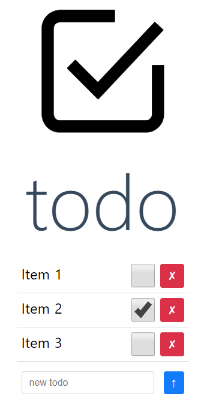

# todo

A todo app for me to help me keep on top of tasks. All articles are stored in localstorage - no back end server or database is used

<div align="center">
  
</div>

## Build Setup

```bash
# install dependencies
$ npm install

# serve with hot reload at localhost:3000
$ npm run dev

# build for production and launch server
$ npm run build
$ npm run start

# generate static project
$ npm run generate
```

For detailed explanation on how things work, check out [Nuxt.js docs](https://nuxtjs.org).
